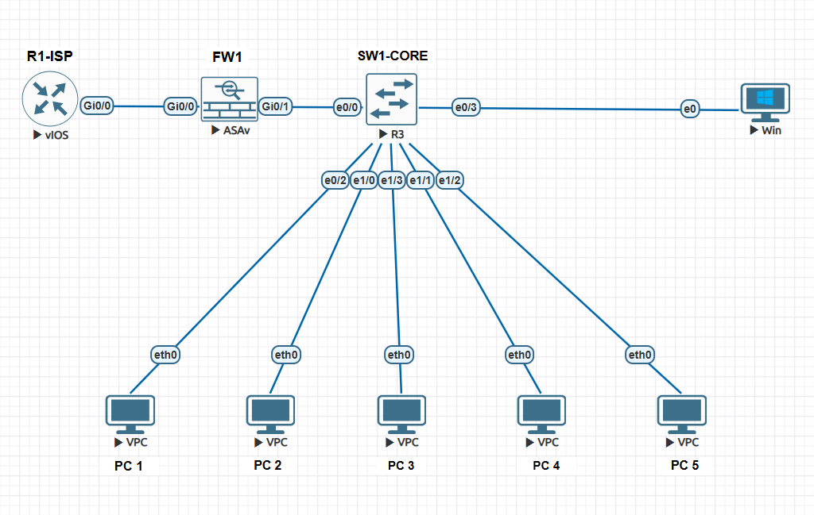

# Lab 02 - ASA Firewall, VLAN Segmentation, and Inter-VLAN Communication

## Objective
Build a segmented network using a Layer 2 switch and Cisco ASAv firewall with 802.1Q trunking, multiple VLANs, ASA subinterfaces, and upstream routing to an ISP router.

## Topology

## Scenario
This lab simulates a small internal network connected to an upstream ISP router through a Cisco ASA firewall.

The ASA acts as the default gateway for multiple VLANs and uses subinterfaces over a trunk link connected to the switch.

## Devices Used
- 1 Cisco vIOS router (`R1-ISP`)
- 1 Cisco ASAv firewall (`FW1`)
- 1 Layer 2 switch (`SW1-CORE`)
- 1 Windows host
- 5 VPCS hosts

## VLAN Design
- VLAN 20: USER
- VLAN 30: SERVER
- VLAN 40: STAFF-WIFI
- VLAN 60: GUEST-WIFI

## Port Mapping
- `SW1-CORE e0/0` ↔ `FW1 gi0/1` → Trunk
- `SW1-CORE e0/3` ↔ `WIN1` → VLAN 20
- `SW1-CORE e0/2` ↔ `PC1` → VLAN 20
- `SW1-CORE e1/0` ↔ `PC2` → VLAN 40
- `SW1-CORE e1/3` ↔ `PC3` → VLAN 30
- `SW1-CORE e1/1` ↔ `PC4` → VLAN 60
- `SW1-CORE e1/2` ↔ `PC5` → VLAN 30

## IP Addressing Plan

### Upstream Link
- `R1-ISP gi0/0` → `10.255.255.1/30`
- `FW1 gi0/0 (outside)` → `10.255.255.2/30`

### VLAN 20 - USER
- `FW1 gi0/1.20` → `192.168.20.1/24`
- `WIN1` → `192.168.20.10/24`
- `PC1` → `192.168.20.11/24`

### VLAN 30 - SERVER
- `FW1 gi0/1.30` → `192.168.30.1/24`
- `PC3` → `192.168.30.11/24`
- `PC5` → `192.168.30.12/24`

### VLAN 40 - STAFF-WIFI
- `FW1 gi0/1.40` → `192.168.40.1/24`
- `PC2` → `192.168.40.11/24`

### VLAN 60 - GUEST-WIFI
- `FW1 gi0/1.60` → `192.168.60.1/24`
- `PC4` → `192.168.60.11/24`

## Configuration Summary

### Router
- Configured upstream interface on `R1-ISP`
- Added static routes for internal VLAN networks through the ASA

### Switch
- Created VLANs 20, 30, 40, and 60
- Assigned access ports to hosts
- Configured `e0/0` as an 802.1Q trunk toward the ASA

### ASA Firewall
- Configured `outside` interface toward the ISP router
- Converted `gi0/1` into a trunk parent interface
- Created VLAN subinterfaces for internal networks
- Added default route toward the upstream router
- Enabled inter-interface traffic between same-security internal VLANs

## Verification
The following checks were performed:

- VLAN creation and port assignments verified on the switch
- Trunk status verified on `SW1-CORE`
- Routing table verified on `R1-ISP`
- Routing table verified on `FW1`
- End-to-end ping tests performed between hosts in different VLANs
- Reachability to the upstream router tested successfully

## Evidence
Verification screenshots are stored in the `verification/` folder:

- `show-vlan.png`
- `show-interfaces-trunk.png`
- `show-route-asa.png`
- `show-ip-route-r1.png`
- `ping-pc1-to-pc3.png`
- `ping-pc1-to-r1.png`

## Configuration Files
Device configurations are stored in the `configs/` folder:

- `R1-ISP.txt`
- `FW1-ASA.txt`
- `SW1-CORE.txt`

## What I Learned
This lab helped me improve my understanding of:

- VLAN segmentation
- Layer 2 access and trunk ports
- ASA trunking with subinterfaces
- Default gateway placement on a firewall
- Static routing between internal and upstream networks
- Structured network troubleshooting and documentation
